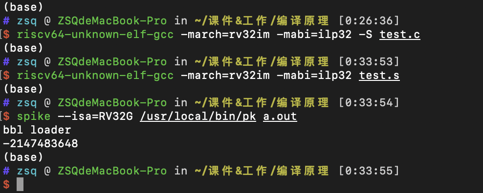

# MiniDecaf实验Step3实验报告

<div style="text-align: center;">2018011358 朱书琦</div>

## 实验内容

本步骤实现了算数二元运算符的编译，为此新增的语法规范如下。

```
expression: additive;

additive: multiplicative | additive ('+'|'-') multiplicative;

multiplicative: unary | multiplicative ('*'|'/'|'%') unary;

unary: primary | ('-'|'!'|'~') unary;

primary: NUM | '(' expression ')';
```

在代码中对以上新出现的每个非终结符增加了 `visit` 函数，按照其各自子节点的数目来分类讨论。

在涉及到运算优先级的问题上，由于一元运算符优先级最高，所以最先和数字结合，并在整个表达式中占最底层，其次是乘除法，最后是加减法。在同级运算中又是遵循从左到右的顺序，所以将优先结合左边的表达式。

## 思考题

1. 压入栈：

    ```assembly
    addi sp, sp, -4
    sw t0, 0(sp)
    ```

    弹出栈：

    ```assembly
    lw t0, 0(sp)
    addi sp, sp, 4
    ```

2. 最小的负数除以 -1 就会出现未定义行为，代码如下，

    ```c
    #include <stdio.h>
    
    int main()
    {
        int a = -2147483648;
        int b = -1;
        printf("%d\n", a / b);
        return 0;
    }
    ```

    运行结果如下

    

    采用处理器为2.3 GHz 双核Intel Core i5，属于x86-64架构。

## 相关参考

如实验内容部分所述，主要参考了实验指导书和所给的 java 样例代码。